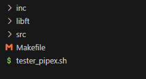
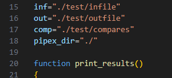
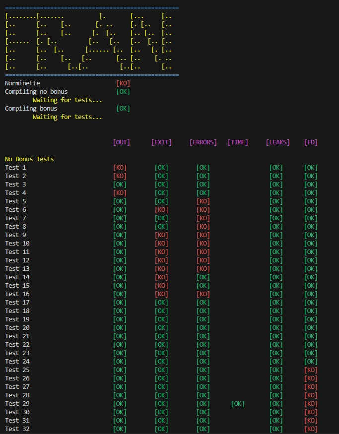
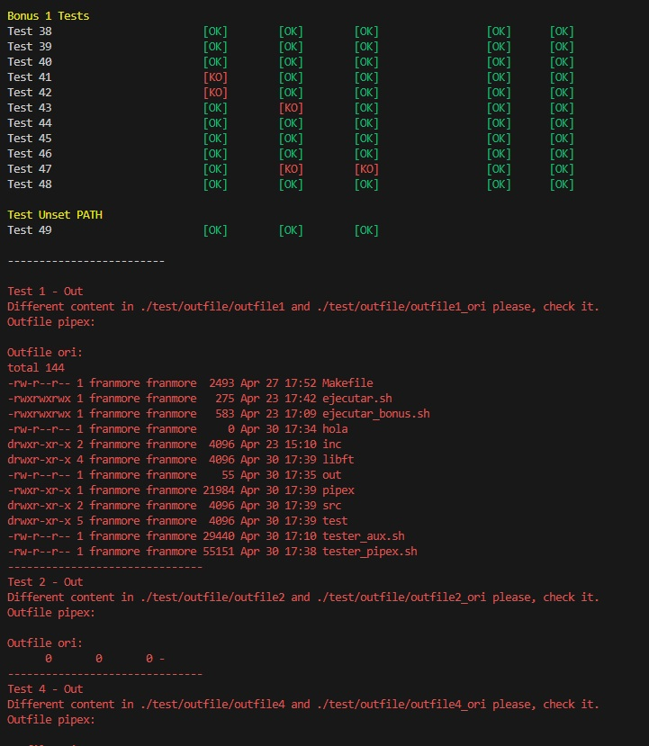
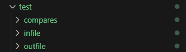
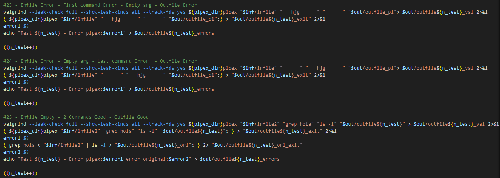

# Tester para Pipex (42 School)

> 🇪🇸 Español | [🇬🇧 English Version](README.md)

Un tester sencillo para el proyecto **Pipex** de 42, desarrollado para sistemas **Linux**. 🐧

> ⚠️ Este tester está escrito **solo para Linux**.

Si este tester te fue útil, ¡agradecería mucho que dejaras una ⭐ en el repositorio para que más gente lo encuentre!

Si encuentras algún bug, lo siento de antemano — puedes escribirme por Slack (@franmore) 📧

He intentado cubrir todos los casos relevantes. Si me he dejado alguno, lo siento.  
Respecto a los tests de `bonus2` (el `DELIMITER`), solo hay uno incluido. No estoy segura de si funciona correctamente porque no pude probar esa parte con mi propio código. ❗

# Uso

## Descarga e Instalación

Clona el repositorio **dentro del directorio de tu proyecto Pipex**:

```bash
git clone https://github.com/Fren2804/tester_pipex42.git

```
MMueve el archivo *.sh desde la carpeta del tester a la raíz de tu directorio de Pipex:



## Ejecución
⚠️ Si tu comando make coloca el binario pipex en un directorio distinto, debes indicar la ruta correcta en tester_pipex.sh, en la línea 18 (pipex_dir):



Usa este comando para ejecutar el tester:

```bash
bash tester_pipex.sh [flag]

```
Flags disponibles (usa solo una a la vez):
| Flag      | Descripción                                         |
|-----------|-----------------------------------------------------|
| `-nobonus` | Ejecuta tests para Pipex sin funciones bonus     |
| `-bonus1`  | Ejecuta los tests de -nobonus + soporte para múltiples comandos |
| `-bonus2`  | Ejecuta los tests de -bonus1 + delimiter (here_doc)     |

## Tests

### ¿Qué prueba?

Este tester comparará la salida de tu `pipex` con la salida original de la shell (`bash`).  
Verifica los siguientes aspectos:

- **fd_output**: La salida real de tu programa.
- **exit**: Se asegura de que el código de salida y los mensajes de error sean correctos.
- **errors**: Valida el valor de retorno de tu programa.
- **duration**: Ejecuta una prueba de tiempo (por ejemplo, con `sleep`) para comprobar retrasos.
- **leaks**: Utiliza `valgrind` para detectar fugas de memoria, `free`s perdidos y errores de memoria.
- **fd**: Verifica que no queden descriptores de archivo abiertos al final del programa.

También se comprueban casos límite como:

- Argumentos vacíos
- Muy pocos o demasiados argumentos (en el caso de Pipex sin bonus)
- Comandos que no existen
- Permisos denegados en `infile` o `outfile`

### ¿Cómo funciona?

1. Primero se ejecuta **Norminette**.
2. Después se compila Pipex **sin bonus**.
3. Si se selecciona una flag de bonus, también se compila Pipex **con bonus**.
4. Luego se ejecutan los tests.
5. Finalmente, verás las **comparaciones entre tu salida y la salida esperada**.

⚠️ Este proceso no es rápido, así que tómalo con calma y ten paciencia.



### Detalles de los tests

Al final de la tabla de resultados, cualquier diferencia entre tu `pipex` y la salida de la shell, así como cualquier fuga de memoria, aparecerán en **rojo**.  
Si todos los tests se completan con éxito, se mostrará un mensaje de felicitación en **verde**. 😄



Si necesitas más información, cada test tiene su propio directorio que contiene:

- Los archivos de entrada (`infile` de ejemplo)
- La salida de tu programa
- La salida original de la shell
- El código de salida
- El valor de retorno
- Resultados de `valgrind`

Puedes revisar estos archivos para hacer un debug más profundo y comparar resultados:



Y si necesitas aún más detalles, puedes buscar en `tester_pipex.sh` usando `#NUMBER`  
para localizar y revisar el código exacto de cada test, junto con un pequeño resumen:



## ⚠️ Notas

**¡Importante!**

Un resultado **KO** no significa necesariamente que tu Pipex esté mal — solo que tu salida no coincidió exactamente con lo que esperaba el tester.

Si tu resultado es razonable o está cerca, puedes continuar.  
Esta herramienta está pensada para **ayudarte a encontrar posibles errores**, no para imponer una implementación exacta.

Sin embargo, si tu `pipex` devuelve `0` cuando debería devolver `1`, `2`, `127` o **cualquier valor distinto de cero** (porque se trata de un error), revísalo.

Si tienes fugas de memoria — revísalo.  
Si dejas descriptores de archivo abiertos — revísalo.


 
 

