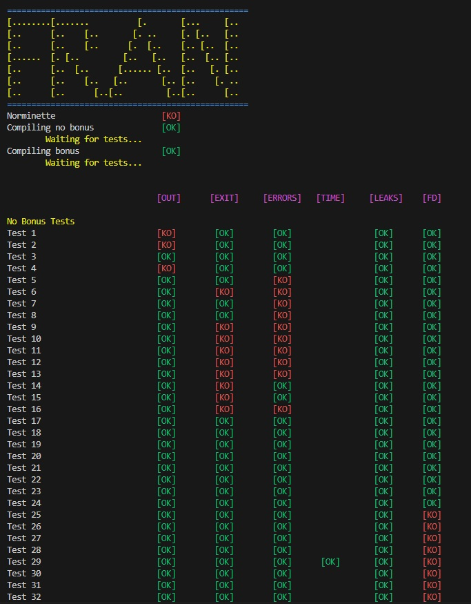
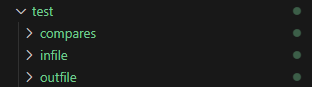

# Tester for Pipex (42 School)

A simple tester for the **Pipex** project from School 42, built for **Linux** systems. 🐧

> ⚠️ This tester is written **only for Linux**.

If this tester was useful to you, I’d really appreciate it if you left a ⭐ on the repo to help others find it!

If you find a bug, my apologies in advance — feel free to reach out to me on Slack (@franmore) 📧

I’ve tried to cover all the relevant cases. If I missed any, I’m sorry!  
Regarding the `bonus2` tests (the `DELIMITER`), there's only one test included. I’m not sure it works correctly because I couldn't test that part with my own code. ❗

# Usage

## Download and Installation

Clone the repository **into your Pipex directory**:

```bash
git clone https://github.com/Fren2804/tester_pipex42.git

```
Move the `*.sh` file from the tester folder to the root of your Pipex directory:


## Run
⚠️ If your `make` command puts the `pipex` binary in a different directory, you must set the correct path in `tester_pipex.sh`, on **line 18** (`pipex_dir`):


Use this command to run the tester:

```bash
bash tester_pipex.sh [flag]

```
Available flags (use only one at a time):
| Flag      | Description                                         |
|-----------|-----------------------------------------------------|
| `-nobonus` | Executes tests for Pipex without bonus features     |
| `-bonus1`  | Executes `-nobonus` tests + multiple command support |
| `-bonus2`  | Executes `-bonus1` tests + delimiter (here_doc)     |

## Tests

### What does it test?

This tester will compare your `pipex` output with the original output from the shell (`bash`).  
It checks the following aspects:

- **fd_output**: The actual output of your program.
- **exit**: Ensures the exit code and error messages are correct.
- **errors**: Validates the return value of your program.
- **duration**: Runs a timing test (e.g. using `sleep`) to check delays.
- **leaks**: Uses `valgrind` to detect memory leaks, missing frees, and memory errors.
- **fd**: Verifies that no file descriptors are left open at the end of the program.

### How it works

1. First of all, it will check **Norminette**.
2. Then, it will compile Pipex **without bonus**.
3. If a bonus flag is selected, it will also compile Pipex **with bonus**.
4. After that, the tests will run.
5. Finally, you'll see the **comparisons between your output and the expected output**.

⚠️ This process is not fast, so take it easy and be patient.



### Test Details

At the end of the results table, any differences between your `pipex` and the shell output, as well as any memory leaks, will appear in **red**.  
If all tests pass successfully, a **green** congratulations message will be displayed. 😄


If you need more information, each test has its own directory containing:

- The input files (infile examples)
- The output of your program
- The original shell output
- The exit status
- The return value
- Valgrind results

You can inspect these files for deeper debugging and comparison:



But if you need even more details, you can search inside `tester_pipex.sh` using `#NUMBER` to locate and review the exact code of each test, along with a short summary:


 
 
