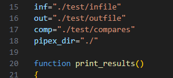

# Tester for Pipex (42 School)

A simple tester for the **Pipex** project from School 42, built for **Linux** systems. 🐧

> ⚠️ This tester is written **only for Linux**.

If this tester was useful to you, I’d really appreciate it if you left a ⭐ on the repo to help others find it!

If you find a bug, my apologies in advance — feel free to reach out to me on Slack (@franmore) 📧

I’ve tried to cover all the relevant cases. If I missed any, I’m sorry!  
Regarding the `bonus2` tests (the `DELIMITER`), there's only one test included. I’m not sure it works correctly because I couldn't test that part with my own code. ❗


# Usage

## Download and Installation

Clone the repository **into your Pipex directory**:

```bash
git clone https://github.com/Fren2804/tester_pipex42.git

```
Move the `*.sh` file from the tester folder to the root of your Pipex directory:


## Run
Use this command:
```bash
bash tester_pipex.sh [flag]

```
Available flags (use only one at a time):
| Flag      | Description                                         |
|-----------|-----------------------------------------------------|
| `-nobonus` | Executes tests for Pipex without bonus features     |
| `-bonus1`  | Executes `-nobonus` tests + multiple command support |
| `-bonus2`  | Executes `-bonus1` tests + delimiter (here_doc)     |

If your `make` command puts the `pipex` binary in a different directory, you must set the correct path in `tester_pipex.sh`, on **line 18** (`pipex_dir`):




 bash tester_pipex.sh
 This tester test, norminette
 And compiling no bonus and bonus test and makefile
 
